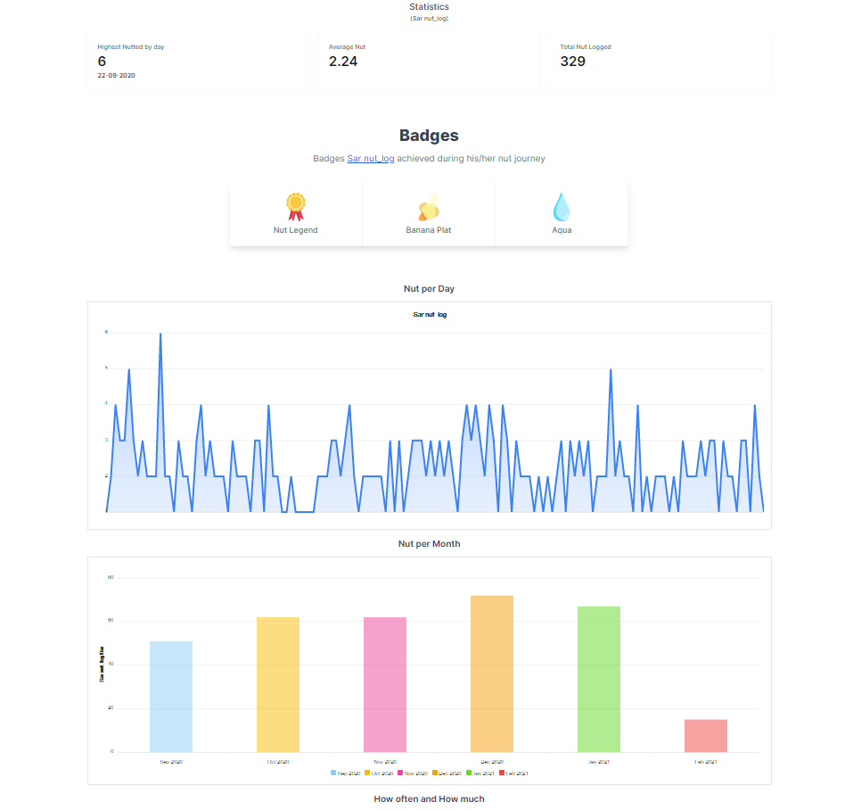

# Nutlog Charts



Get a detailed overview of your Nut Logs💦. More features for this web app is planned and will be added soon. If you have any ideas you are welcome to share. 
You are welcome to improve and send pull requests.

Inspired by [shihaamabr](https://github.com/shihaamabr) life.

## Features 🛸

- Highest nutted by day (stats)
- Average Nut (stats)
- Total nut logged (stats)
- Nut Per Day (graph)
- Nut Per Month (graph)
- Nut Amount per day (How often and how much graph)
- Badge System (award badge according to stats)

## Badge Award System 🪐

### Nut Badge
 -  Nut Legend (Total Nut >= 150)
 -  Nut Silver (Total Nut <= 100 && Total Nut >= 50)
 -  Nut Noob (Else)
 
###  Plats
-  Banana Plat (average > 2)
-  Potato Plat (average < 2)
-  Orange Plat (Else)

### Elements
- Eternal flame (Highest nutted >= 8)
- Aqua (Highest nutted < 8 && Highest nutted > 3)
- Puff (Else)

## Setup

### Clone the repo 

```
git clone https://github.com/boring-dragon/nut-log-chart.git
```

### Setup .env and Database

```
cp .env.example .env
```
Change database connection to sqlite
```
DB_CONNECTION=sqlite
```
Create the sqlite database. This will be used to generate the share link
```
touch database/database.sqlite
```
Migrate the database
```
php artisan migrate
```

### Install composer dependencies

```
composer install
```

### Install npm dependencies and bundle

```
npm install & npm run dev
```
