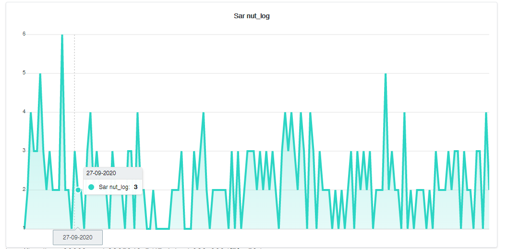

# Nutlog Charts



Get a detailed overview of your Nut Logs💦

## Setup

### Clone the repo 

```
git clone https://github.com/boring-dragon/nut-log-chart.git
```

### Setup .env and Database

```
cp .env.example .env
```
Change database connection to sqlite
```
DB_CONNECTION=sqlite
```
Create the sqlite database. This will be used to generate the share link
```
touch database/database.sqlite
```
Migrate the database
```
php artisan migrate
```

### Install composer dependencies

```
composer install
```

### Install npm dependencies and bundle

```
npm install & npm run dev
```
